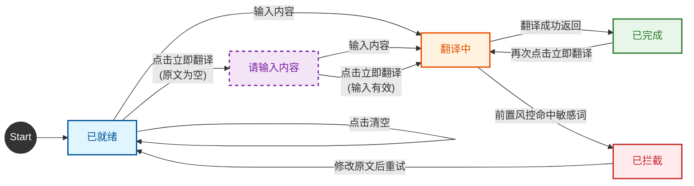

# 机器翻译 页面需求说明

## 第一章：产品概述

机器翻译是 AI Hub 工具箱中的核心基础工具，旨在为用户提供准确、流畅的多语言互译服务。本页面承载以下核心能力：

- **多语言互译**：支持全球主流语种之间的双向翻译，提供自动检测源语言能力。
- **专业领域适配**：通过选择专业领域加载对应术语库，提升特定行业名词的翻译准确度。
- **敏感词风控**：对输入文本进行前置敏感词检测，命中高危词时拦截翻译请求，保障内容合规。
- **敏感词自助管理**：用户可在弹窗中对敏感词列表进行新增、删除、编辑、查询操作，变更实时生效于风控判定。
- **译文结果操作**：支持译文朗读（语音合成）与一键复制（自动过滤脱敏符号）。

页面采用深色/浅色双主题，中文/英文双语界面，固定 1920×1024 画布居中布局。

---

## 第二章：用户角色与场景

| 用户角色 | 典型场景 | 核心需求 |
|---------|---------|---------|
| 跨国业务人员 | 翻译商务邮件、合同草案 | 术语准确，支持法律/金融等领域术语库 |
| 内容创作者 | 汉化海外资讯、搬运内容 | 大字数支持（最高 2000 字），快速复制结果 |
| 普通用户 | 查词、简单句子交流 | 操作快捷，即输即译，无需复杂配置 |
| 合规管理员 | 维护敏感词库，保障翻译内容合规 | 可增删改查敏感词，变更即时影响风控拦截 |

---

## 第三章：业务流程图

### 3.1 翻译状态流转

<!-- src: 依据原型翻译主流程与状态指示器逻辑整理 -->

### 3.2 状态标签与圆点颜色

| 状态 | 标签文案（中文/英文） | 圆点颜色 |
|------|---------------------|---------|
| 已就绪 | 已就绪 / Ready | 绿色 |
| 翻译中 | 翻译中 / Translating | 黄色 |
| 已完成 | 已完成 / Done | 绿色 |
| 已拦截 | 已拦截 / Blocked | 红色 |
| 请输入内容 | 请输入内容 / Empty | 红色 |

### 3.3 敏感词管理按钮激活态

| 状态 | 表现 | 触发条件 |
|------|------|---------|
| 激活态 | 显示青色状态指示点 | 敏感词列表非空 |
| 非激活态 | 不显示状态指示点 | 敏感词列表为空 |

---

## 第四章：字段与业务约束表

### 4.1 顶部导航栏

| 字段/组件名称 | 类型 | 必填 | 业务约束与规则 |
|-------------|------|------|---------------|
| 界面语言切换按钮 | 按钮（带下拉指示） | — | 切换中文/英文界面，按钮显示当前语言；切换后所有界面文案同步更新 |
| 主题切换按钮 | 图标按钮 | — | 月亮/太阳图标，切换深色/浅色主题 |

### 4.2 配置工具栏

| 字段/组件名称 | 类型 | 必填 | 业务约束与规则 |
|-------------|------|------|---------------|
| 源语言选择器 | 下拉选择框 | 否 | 默认「自动检测」；可选自动检测/中文/英语/日语/韩语/法语/德语/西班牙语/俄语/阿拉伯语/葡萄牙语/意大利语（共 12 项） |
| 语言互换按钮 | 图标按钮 | — | 交换源语言与目标语言；若源语言为「自动检测」，互换时取中文作为新目标语言；保留原文内容 |
| 目标语言选择器 | 下拉选择框（默认高亮） | 否 | 默认英语；可选中文/英语/日语/韩语/法语/德语/西班牙语/俄语/阿拉伯语/葡萄牙语/意大利语（共 11 项，不含自动检测） |
| 专业领域选择器 | 下拉选择框 | 否 | 默认「通用」；可选通用/信息技术/生物医药/金融财经/法律合同（共 5 项）；切换后若已有译文，按新领域自动重新翻译 |
| 敏感词管理按钮 | 按钮（带状态指示点） | — | 敏感词列表非空时为激活态，显示青色圆点；列表为空时不显示圆点；点击打开敏感词管理弹窗 |
| 立即翻译按钮 | 主操作按钮 | — | 触发翻译动作；翻译执行期间按钮禁用并显示加载态 |

### 4.3 翻译区

| 字段/组件名称 | 类型 | 必填 | 业务约束与规则 |
|-------------|------|------|---------------|
| 原文输入框 | 多行文本输入框 | 否 | 占位提示「请输入要翻译的单词或句子」；字数限制 2000 字，超限禁止继续输入；右下角实时显示「当前字数 / 2000」 |
| 原文清空按钮 | 图标按钮 | — | 清空原文内容、字数计数归零、清空译文结果、隐藏错误提示 |
| 译文展示区 | 文本展示区 | — | 展示翻译结果，支持长文本滚动；无结果时显示占位提示「翻译结果将显示在这里 / 点击「立即翻译」开始」 |
| 状态指示器 | 状态标签（带圆点） | — | 反映翻译状态（详见第三章）；圆点颜色随状态变化：就绪/完成为绿色，翻译中为黄色，拦截/空内容为红色 |
| 朗读按钮 | 图标按钮 | — | 调用语音合成朗读译文；朗读中显示脉冲动画，再次点击停止朗读 |
| 复制按钮 | 图标按钮 | — | 复制译文到剪贴板；复制时自动过滤脱敏符号 `***`，保证复制内容完整 |
| 底部信息条 | 说明文本 | — | 显示当前领域与敏感词过滤状态，如「领域：通用 · 敏感词过滤已开启」 |

### 4.4 敏感词管理弹窗

> 模态浮层，点击敏感词管理按钮触发，覆盖全屏半透明遮罩。

| 字段/组件名称 | 类型 | 必填 | 业务约束与规则 |
|-------------|------|------|---------------|
| 敏感词搜索框 | 文本输入框 | 否 | 占位提示「搜索敏感词…」；输入时实时过滤下方列表，仅显示匹配项 |
| 敏感词列表项 | 列表行 | — | 每行包含：标签图标 + 敏感词文本 + 编辑按钮 + 删除按钮 |
| 行内编辑输入框 | 文本输入框（行内态） | 否 | 编辑某词时出现；字数限制 30 字；回车保存，Esc 取消 |
| 新增敏感词输入框 | 文本输入框 | 否 | 占位提示「输入新敏感词，回车添加」；字数限制 30 字；回车提交 |
| 取消按钮 | 次要按钮 | — | 关闭弹窗，取消所有进行中的行内编辑 |
| 保存按钮 | 主要按钮 | — | 保存所有变更，关闭弹窗，更新风控列表与底部信息条 |

### 4.5 全局轻提示

| 字段/组件名称 | 类型 | 必填 | 业务约束与规则 |
|-------------|------|------|---------------|
| 轻提示（Toast） | 浮层提示 | — | 右下角显示，2.2 秒后自动消失；用于复制结果、敏感词操作结果等反馈 |

---

## 第五章：交互逻辑矩阵

### 5.1 语言与领域配置操作

| 操作对象 | 触发条件 | 操作行为 | 业务规则 | 反馈结果 |
|---------|---------|---------|---------|---------|
| 源语言选择器 | 展开菜单后选中某项 | 更新源语言，关闭菜单 | 无 | 无 |
| 目标语言选择器 | 展开菜单后选中某项 | 更新目标语言，译文标题同步更新 | 无 | 无 |
| 语言互换按钮 | 按钮被点击 | 交换源语言与目标语言，保留原文内容 | 源语言为「自动检测」时，互换时取中文作为新目标语言 | 无 |
| 专业领域选择器 | 展开菜单后选中某项 | 更新领域 | 若已有译文则按新领域自动重新翻译 | 无 |

### 5.2 翻译操作

| 操作对象 | 触发条件 | 操作行为 | 业务规则 | 反馈结果 |
|---------|---------|---------|---------|---------|
| 立即翻译按钮 | 始终可点击；翻译执行期间禁用 | 校验输入 → 前置风控检测 → 执行翻译 → 展示结果 | 原文为空→拦截；超 2000 字→拦截；敏感词命中→拦截 | 译文展示在结果区（详见第六章异常处理） |
| 清空按钮 | 始终可点击 | 清空原文、字数归零、清空译文、隐藏错误提示、聚焦输入框 | 无 | 无 |

### 5.3 译文结果操作

| 操作对象 | 触发条件 | 操作行为 | 业务规则 | 反馈结果 |
|---------|---------|---------|---------|---------|
| 朗读按钮 | 译文区有内容 | 调用语音合成朗读译文；朗读中再次点击停止 | 无结果时不响应 | 浏览器不支持语音合成时提示「浏览器不支持语音朗读」 |
| 复制按钮 | 译文区有内容 | 过滤脱敏符号后写入剪贴板；剪贴板 API 失败时降级兼容方式复制 | 无结果时不响应 | 成功：「复制成功」；失败：「复制失败」 |

### 5.4 敏感词管理操作（弹窗内）

| 操作对象 | 触发条件 | 操作行为 | 业务规则 | 反馈结果 |
|---------|---------|---------|---------|---------|
| 敏感词管理按钮（打开弹窗） | 按钮被点击 | 渲染敏感词列表，聚焦新增输入框 | 无 | 无 |
| 敏感词搜索框 | 输入文本 | 实时过滤列表，仅显示匹配项 | 显示总数不变 | 无 |
| 新增敏感词输入框 | 输入并回车 | 将敏感词加入列表，清空输入框 | 不能为空；不能与已有重复 | 成功：「已添加」；失败：「请输入敏感词」/「该敏感词已存在」 |
| 列表项编辑按钮 | 按钮被点击 | 该行变为可编辑输入框，聚焦并全选当前内容 | 无 | 无 |
| 行内编辑输入框（保存编辑） | 编辑态下回车或点击保存按钮 | 校验后更新该敏感词 | 不能为空；不能与已有重复 | 成功：「已更新」；失败：「敏感词不能为空」/「该敏感词已存在」 |
| 取消编辑 | 编辑态下点击取消按钮或按 Esc | 退出编辑态，恢复原值 | 无 | 无 |
| 列表项删除按钮 | 按钮被点击 | 从列表移除该敏感词 | 无 | 「已删除」 |
| 保存按钮（保存并关闭） | 按钮被点击 | 保存所有变更，关闭弹窗，更新风控列表与底部信息条 | 若已有译文则重新翻译 | 无 |
| 取消按钮/关闭按钮（取消并关闭） | 按钮被点击 | 关闭弹窗，取消所有进行中的行内编辑 | 无 | 无 |

---

## 第六章：异常处理与兜底策略

| 异常场景 | 触发条件 | 系统处理 | 用户提示 |
|---------|---------|---------|---------|
| 空内容提交 | 点击立即翻译时原文为空 | 阻止翻译请求，状态置「请输入内容」 | 「请输入要翻译的内容。」 |
| 文本超长 | 原文超过 2000 字 | 输入框禁止继续输入；点击翻译时再次拦截 | 「文本过长，请拆分后重试。」 |
| 敏感词命中 | 敏感词过滤开启且原文包含敏感词列表中的词 | 拦截翻译请求，清空结果区，状态置「已拦截」，命中词以 `***` 掩码显示 | 「文本包含敏感内容，已拦截，请修改后重试。」 |
| 字数预警 | 输入字数超过 1800 且不足 2000 | 字数计数变黄色 | 无（视觉提示） |
| 字数超限 | 输入字数达到 2000 | 字数计数变红色，输入框禁止继续输入 | 无（视觉提示） |
| 翻译中重复点击 | 翻译执行期间再次点击立即翻译 | 按钮禁用，忽略重复点击 | 无 |
| 复制失败 | 剪贴板写入失败 | 降级使用兼容方式复制；仍失败则提示 | 「复制失败」 |
| 语音朗读不可用 | 浏览器不支持语音合成 | 不执行朗读 | 「浏览器不支持语音朗读」 |
| 敏感词重复 | 新增或编辑的敏感词已存在 | 阻止写入 | 「该敏感词已存在」 |
| 敏感词为空 | 新增或编辑时未输入内容 | 阻止写入 | 「敏感词不能为空」 |

### 反馈文案汇总（测试校验用）

**轻提示（Toast）文案：**

| 场景 | 中文文案 | 英文文案 |
|------|---------|---------|
| 复制成功 | 复制成功 | Copied |
| 复制失败 | 复制失败 | Copy failed |
| 语音不支持 | 浏览器不支持语音朗读 | TTS not supported |
| 敏感词新增成功 | 已添加 | — |
| 敏感词更新成功 | 已更新 | — |
| 敏感词删除成功 | 已删除 | — |
| 敏感词为空 | 敏感词不能为空 | — |
| 敏感词重复 | 该敏感词已存在 | — |
| 未输入敏感词 | 请输入敏感词 | — |

**错误提示条文案：**

| 场景 | 文案 |
|------|------|
| 空内容 | 请输入要翻译的内容。 |
| 超长 | 文本过长，请拆分后重试。 |
| 敏感词拦截 | 文本包含敏感内容，已拦截，请修改后重试。 |

---

## 第七章：数据埋点与性能需求

### 7.1 核心操作埋点（建议）

> 以下埋点项在当前原型中未体现，为产品建议项，需与数据团队确认后落地。

| 埋点事件 | 触发时机 | 关键属性 |
|---------|---------|---------|
| 翻译请求发起 | 点击立即翻译 | 源语言、目标语言、专业领域、原文长度、是否开启敏感词过滤 |
| 翻译完成 | 翻译结果返回 | 耗时、是否命中敏感词、领域 |
| 敏感词拦截 | 前置风控命中 | 命中敏感词数量、领域 |
| 复制译文 | 点击复制按钮 | 译文长度、目标语言 |
| 朗读译文 | 点击朗读按钮 | 目标语言、译文长度 |
| 敏感词管理操作 | 新增/删除/编辑 | 操作类型、敏感词总数 |
| 主题切换 | 点击主题切换 | 切换后主题 |
| 界面语言切换 | 点击语言切换 | 切换后语言 |

### 7.2 性能需求（建议）

> 以下性能指标在当前原型中未体现，为产品建议项。

| 指标 | 建议值 | 说明 |
|------|--------|------|
| 翻译响应时间 | ≤ 2 秒（常规文本） | 从点击翻译到结果展示；长文本可放宽至 5 秒 |
| 页面首屏加载 | ≤ 1.5 秒 | 包含字体、图标、背景渲染 |
| 敏感词弹窗打开 | ≤ 200 毫秒 | 点击按钮到弹窗完全展示 |
| 敏感词列表渲染 | ≤ 100 毫秒 | 100 条敏感词以内无明显延迟 |
| 输入字数计数 | 实时（无感知延迟） | 输入即更新计数 |
| 语音合成启动 | ≤ 500 毫秒 | 点击朗读到开始播放 |

---

## 附：待补充事项

以下内容在当前原型中未体现，需产品/业务方确认后补充：

1. **角色权限**：页面访问是否需要特定角色/权限控制。
2. **入口与路由**：从哪个菜单/页面进入，路由级可见性条件。
3. **网络异常处理**：翻译请求网络失败时的提示与恢复策略（如「网络连接失败，请检查网络设置」，保留输入内容不丢失）。
4. **后置风控**：译文输出前的二次敏感词检测与熔断逻辑。
5. **多引擎降级**：冷门语种置信度低时的统计机器翻译兜底策略。
6. **并发与请求取消**：连续翻译请求的防抖与取消机制。
7. **敏感词分级处置**：当前原型所有命中均按一级拦截处理；业务上是否需要二级中危（降级改写）、三级低危（轻度润色）的分级策略。
