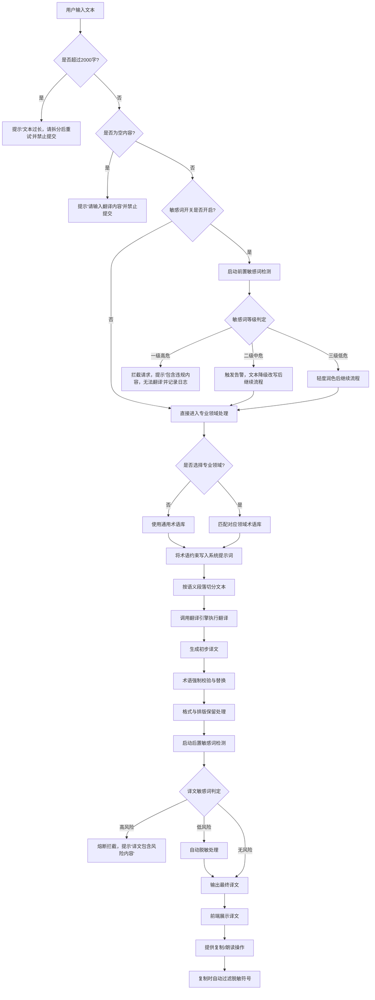

# 机器翻译功能产品说明书 (PRD)

## 1. 产品概述

### 1.1 产品背景

"机器翻译"是 AI Hub 工具箱中的核心基础工具之一。旨在利用先进的神经网络翻译模型，为用户提供准确、流畅的多语言互译服务。当前版本虽然具备基础翻译能力，但在交互效率、场景化适配及用户体验上存在优化空间，计划进行重构以提升用户满意度和使用粘性。

### 1.2 产品目标

- **核心目标**：提供高准确度、低延迟的文本翻译服务。
- **体验目标**：简化操作流程，支持多场景（如专业文档、日常对话）的差异化翻译需求。
- **重构重点**：优化输入输出交互逻辑，增强高级功能的易用性（如敏感词过滤、领域选择）。

---

## 2. 用户角色与场景

| 用户角色 | 典型场景 | 核心痛点/需求 |
| :--- | :--- | :--- |
| **跨国业务人员** | 翻译商务邮件、合同草案 | 需要术语准确，支持特定行业领域（如法律、医疗）。 |
| **内容创作者** | 搬运或汉化海外资讯 | 需要大字数支持，快速复制结果，语意通顺。 |
| **普通用户** | 查词、简单句子交流 | 操作要快，不需要复杂设置，即输即译。 |

---

## 3. 功能详细说明

### 3.1 语言选择模块

- **源语言选择**：
    - 默认显示"自动检测"或上次使用的语言。
    - 支持搜索和滚动选择全球主流语种。
- **目标语言选择**：
    - 默认显示"英语"或根据源语言智能推荐。
- **语言互换**：
    - 点击中间互换图标，快速交换源语言与目标语言，并保留原文内容。

### 3.2 文本输入区（左侧）

- **输入限制**：
    - 支持纯文本输入。
    - 字符上限：2000字（含标点符号）。
    - 实时计数：右下角显示 当前字数/总上限（如 0/2000）。
- **交互反馈**：
    - 当字数接近上限（如 >1800）时，计数变黄预警；达到上限禁止继续输入并提示。
    - 支持粘贴纯文本，自动过滤富文本格式。
- **占位符提示**：未输入时显示"请输入要翻译的单词或句子"。

### 3.3 翻译控制与配置（顶部栏）

- **立即翻译按钮**：
    - 手动触发翻译动作。
    - 可增加"随输随译"开关，满足实时性需求。
- **专业领域选择**：
    - 下拉菜单选项：通用、信息技术、生物医药、金融财经、法律合同等。
    - 作用：加载对应的垂直领域术语库，提高特定名词翻译准确率。
- **敏感词处理**：
    - 功能入口：点击"敏感词"按钮。
    - 逻辑：开启后，系统将识别输入文本中的违规或敏感内容，并进行掩码处理（如 \*\*\*）或阻断翻译并提示风险。

### 3.4 结果展示区（右侧）

- **译文展示**：
    - 实时或异步展示翻译后的文本。
    - 保持段落结构，支持长文本滚动查看。
- **结果操作工具栏**（位于右下角）：
    - **朗读功能**：点击喇叭图标，调用 TTS (Text-to-Speech) 引擎朗读译文。需支持暂停/重读。
    - **复制功能**：点击复制图标，一键将译文写入剪贴板，并给予"复制成功"的 Toast 提示。

---

## 4. 异常流程与边界条件

1. **网络异常**：点击翻译时若无网络，需弹出提示"网络连接失败，请检查网络设置"，并保留输入框内容不丢失。
2. **空内容提交**：输入框为空时点击"立即翻译"，右侧结果区应清空或显示"请输入内容"，不应报错。
3. **超长文本**：超过 2000 字时，截断多余部分或提示用户拆分翻译。
4. **特殊字符**：支持 Emoji 及常见数学符号的透传或转义，不应导致系统崩溃。

---

## 5. 核心处理流程说明

作为产品经理，针对机器翻译模块中"文本翻译"、"专业领域术语"和"敏感词风控"这三者的逻辑关系与处理流程，我们需要构建一个**多层级、分阶段**的系统架构。这三者并非相互独立，而是需要有机结合，以确保翻译的**准确性、专业性、安全性与合规性**。

### 5.1 核心处理流程（后端视角）

整个翻译请求的生命周期应遵循：**前置风控 -> 术语提取 -> 翻译引擎调用 -> 术语后处理 -> 后置风控** 的闭环逻辑。

#### 5.1.1 前置风控过滤（Pre-processing & Security）

在用户点击"立即翻译"的瞬间，系统首先拦截文本进行安全审查，避免违规内容进入大模型或翻译引擎。

- **机制**：采用"DFA/AC自动机算法 + NLP语义分析"双层检测。
- **命中处理策略（分级处置）**：
    - **一级高危（零容忍）**：如涉政、暴恐、色情等违规词。系统直接**拦截请求**，前端提示"包含违规内容，无法翻译"，并记录审计日志。
    - **二级中危（疑似/擦边）**：如部分广告引流、轻度争议词。系统触发**告警并转人工复核**，或采用"降级/改写策略"（如弱化表达），保留核心语义后继续翻译。
    - **三级低危（表述不严谨）**：如拼写错误、轻微歧义词。系统仅作**轻度润色**，不拦截，直接放行。

#### 5.1.2 专业领域与术语处理（Domain & Terminology Handling）

当文本通过前置风控后，系统根据用户选择的"专业领域"进行术语优化。

- **术语提取与约束**：系统根据用户选择的领域（如IT、医疗、法律），自动匹配对应的"自定义术语库"或"专业领域知识图谱"。
- **提示词工程（Prompt Engineering）**：在调用翻译大模型前，将提取出的双语术语对作为**强约束条件**写入系统提示词（System Prompt）。
    - *例如*："请严格按照以下术语表进行翻译：API -> Application Programming Interface。文本内容：..."
- **分段翻译策略**：对于2000字的长文本，按语义段落（如每段400字）进行切分，防止上下文坍缩，确保术语在不同段落中保持一致。

#### 5.1.3 翻译引擎执行（Translation Execution）

- **多引擎协同**：以神经网络翻译（NMT）大模型为核心。若用户选择了极冷门语种且大模型置信度低，可降级调用统计机器翻译（SMT）作为兜底。
- **语境适配**：大模型根据Prompt中的"专业领域"标签和术语约束，进行语义分析与结构转换，生成初步译文。

#### 5.1.4 后处理与质量闭环（Post-processing & Quality Assurance）

- **术语强制校验（强制替换）**：翻译完成后，使用规则引擎对译文进行"回溯检查"。若大模型未完全遵守提示词，系统需**强制将通用译文替换为术语库中的标准译法**，确保专业度100%。
- **格式与排版保留**：自动检测并保留原文的标点、换行符、代码标签等排版格式。

#### 5.1.5 后置风控检测（Output Security）

- **流式风控与拦截**：译文返回前端展示前，需再次经过敏感词检测（特别是针对AI可能产生的"幻觉"或不安全输出）。
- **命中处理**：
    - 若译文包含高风险内容，立即触发熔断，拦截译文。
    - 若仅包含局部轻微不合规内容，自动进行脱敏（如替换为 \*\*\*）后展示给用户。

### 5.2 前端交互逻辑（用户视角）

为了提升用户体验，前端的交互流程需要与后端逻辑无缝衔接：

1. **输入阶段**：
    - 用户选择源语言、目标语言、下拉选择"专业领域"（默认为通用），点击"敏感词过滤"开关（默认开启，增强用户安全感）。
    - 输入文本，字数超过 1800 时计数器变黄预警，达到 2000 禁用输入。

2. **翻译触发阶段**：
    - 点击"立即翻译"后，按钮置灰并显示 Loading 状态。
    - **若触发前置高危拦截**：立即在输入框下方红字提示"文本包含敏感内容，已拦截，请修改后重试"。
    - **若触发前置中危/低危**：正常发送请求，或在翻译结果展示前弹出轻提示"已对文本进行合规化处理"。

3. **结果展示阶段**：
    - 右侧翻译面板显示最终译文。
    - **交互优化**：译文区域右下角提供"复制"、"朗读"图标。若用户点击"复制"，系统自动过滤掉译文中的脱敏符号（如 \*\*\*），保证复制内容的完整性。

---

## 8. 流程图（Mermaid）

